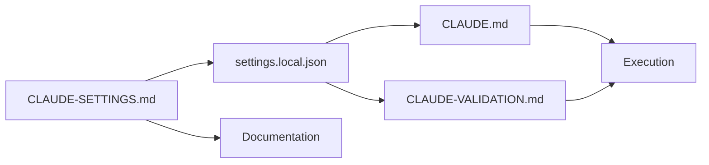

# CLAUDE-SETTINGS.md - Configuration & Permissions Claude Code

## 📋 Configuration des Permissions

### Structure Recommandée
```
.claude/
├── settings.json          # Config globale projet
├── settings.local.json    # Override local (non versionné)
├── CLAUDE.md             # Instructions critiques
└── [autres fichiers...]
```

## 🔐 Permissions Sécurisées (Basé sur votre config)

### settings.local.json Optimisé
```json
{
  "permissions": {
    "allow": [
      // Git - Opérations sûres uniquement
      "Bash(git config:*)",
      "Bash(git fetch:*)",
      "Bash(git push:*)",
      "Bash(git add:*)",
      "Bash(git commit:*)",
      "Bash(git status)",
      "Bash(git diff:*)",
      "Bash(git log:*)",
      
      // NPM - Build & Test
      "Bash(npm run typecheck:*)",
      "Bash(npm install)",
      "Bash(npm test:*)",
      "Bash(npm run build:*)",
      "Bash(npm run lint:*)",
      
      // Node & TypeScript
      "Bash(npx tsc:*)",
      "Bash(node:*)",
      
      // Utils
      "Bash(tee:*)",
      "Bash(grep:*)",
      "Bash(find:*)",
      "Bash(ls:*)",
      "Bash(cat:*)",
      
      // Projet spécifique
      "Bash(./packages/cli/dist/bin/claude-stack.js:*)",
      
      // Python si nécessaire
      "Bash(pytest:*)",
      "Bash(python -m:*)"
    ],
    "deny": [
      // Sécurité critique
      "Bash(rm -rf)",
      "Bash(sudo:*)",
      "Bash(chmod 777:*)",
      "Bash(curl:*)",
      "Bash(wget:*)",
      
      // Modifications système
      "Bash(apt:*)",
      "Bash(brew:*)",
      "Bash(systemctl:*)",
      
      // Secrets
      "Bash(*API_KEY*)",
      "Bash(*SECRET*)",
      "Bash(*PASSWORD*)"
    ],
    "ask": [
      // Demander confirmation pour
      "Bash(git push --force:*)",
      "Bash(npm publish)",
      "Bash(docker:*)",
      "Bash(rm:*)",
      "Bash(mv:*)"
    ]
  },
  
  // Autres settings alignés avec CLAUDE.md
  "model": "claude-opus-4-1-20250805",
  "autoAcceptThreshold": "never",
  "contextFiles": [
    "CLAUDE.md",
    "CLAUDE-VALIDATION.md"
  ],
  "agents": {
    "useSubagents": true
  },
  "validation": {
    "requireTests": true,
    "minCoverage": 90,
    "maxFileChanges": 3,
    "maxLinesPerChange": 100
  }
}
```

## 🎯 Patterns de Permissions

### Pattern Restrictif (Recommandé)
```json
// Autoriser seulement des commandes spécifiques avec arguments
"allow": [
  "Bash(npm test -- --coverage)",  // Exact
  "Bash(npm test:unit:*)",         // Wildcard fin
  "Bash(git commit -m:*)"          // Wildcard message
]
```

### Pattern Par Environnement
```json
// development.json
{
  "permissions": {
    "allow": ["Bash(npm run dev:*)", "Bash(docker:*)"]
  }
}

// production.json
{
  "permissions": {
    "deny": ["Bash(npm run dev:*)", "Bash(docker:*)"],
    "allow": ["Bash(npm run build)", "Bash(npm test)"]
  }
}
```

## 📊 Matrice de Permissions par Rôle

| Commande | Dev Local | CI/CD | Production |
|----------|-----------|-------|------------|
| git add/commit | ✅ Allow | ✅ Allow | ❌ Deny |
| git push | ✅ Allow | ✅ Allow | ❌ Deny |
| npm install | ✅ Allow | ✅ Allow | ❌ Deny |
| npm test | ✅ Allow | ✅ Allow | ✅ Allow |
| npm build | ✅ Allow | ✅ Allow | ✅ Allow |
| rm -rf | ❌ Deny | ❌ Deny | ❌ Deny |
| docker | 🔔 Ask | ✅ Allow | ❌ Deny |

## 🔄 Workflow d'Intégration

### 1. Combiner avec CLAUDE.md
```bash
# CLAUDE.md référence les permissions
"Voir CLAUDE-SETTINGS.md pour permissions détaillées"
"Commandes autorisées dans settings.local.json"
```

### 2. Validation au Démarrage
```bash
# Script de validation des permissions
claude "Vérifie mes permissions avec: cat .claude/settings.local.json"
claude "Liste les commandes que je peux exécuter"
```

### 3. Override Temporaire
```bash
# Pour session spéciale (debug)
claude --permissions-override debug.json

# debug.json avec permissions étendues temporaires
{
  "permissions": {
    "allow": ["Bash(strace:*)", "Bash(lsof:*)"]
  }
}
```

## 🚨 Sécurité & Best Practices

### Règles d'Or
1. **Never in Git** : `settings.local.json` dans `.gitignore`
2. **Principe du Moindre Privilège** : Autoriser minimum nécessaire
3. **Wildcards Prudents** : Éviter `Bash(*)` 
4. **Deny List First** : Bloquer le dangereux avant d'autoriser
5. **Ask for Borderline** : Dans le doute, demander

### Anti-Patterns à Éviter
```json
// ❌ MAUVAIS - Trop permissif
"allow": ["Bash(*)"]

// ❌ MAUVAIS - Secrets exposés
"allow": ["Bash(echo $API_KEY)"]

// ❌ MAUVAIS - Destruction possible
"allow": ["Bash(rm -rf *)"]
```

### Patterns Sécurisés
```json
// ✅ BON - Spécifique
"allow": ["Bash(rm ./tmp/*.log)"]

// ✅ BON - Lecture seule pour secrets
"allow": ["Bash(grep -c API_KEY .env)"]

// ✅ BON - Safe cleanup
"allow": ["Bash(git clean -fd)"]
```

## 🔍 Audit & Monitoring

### Log des Commandes
```bash
# Activer logging complet
export CLAUDE_LOG_COMMANDS=true
export CLAUDE_LOG_FILE=.claude/commands.log

# Analyser usage
grep "denied" .claude/commands.log
grep "asked" .claude/commands.log
```

### Métriques d'Usage
```bash
# Top commandes utilisées
cat .claude/commands.log | \
  grep "executed" | \
  cut -d: -f2 | \
  sort | uniq -c | sort -rn

# Commandes refusées
cat .claude/commands.log | \
  grep "denied" | \
  wc -l
```

## 📈 Evolution Progressive

### Phase 1 : Restrictif (Semaine 1)
```json
{
  "permissions": {
    "allow": [
      "Bash(npm test)",
      "Bash(git status)"
    ]
  }
}
```

### Phase 2 : Productif (Semaine 2+)
```json
{
  "permissions": {
    "allow": [
      // Ajouter progressivement selon besoins validés
      "Bash(npm test:*)",
      "Bash(git add:*)",
      "Bash(git commit:*)"
    ]
  }
}
```

### Phase 3 : Optimisé (Mois 2+)
```json
// Permissions affinées selon patterns d'usage réels
// Basé sur logs et métriques
```

## 🔗 Intégration avec Autres Fichiers



## ✅ Checklist de Validation

- [ ] `settings.local.json` présent
- [ ] Pas de `Bash(*)` dans allow
- [ ] Commandes dangereuses dans deny
- [ ] `.gitignore` contient settings.local.json
- [ ] Permissions testées avec dry-run
- [ ] Log activé pour audit
- [ ] Backup des permissions fonctionnelles

---

**Version** : 1.0.0  
**Sécurité** : Niveau MAX  
**Compatible** : Claude Code v4.1+

**Voir aussi** : CLAUDE.md | CLAUDE-VALIDATION.md | CLAUDE-WORKFLOWS.md