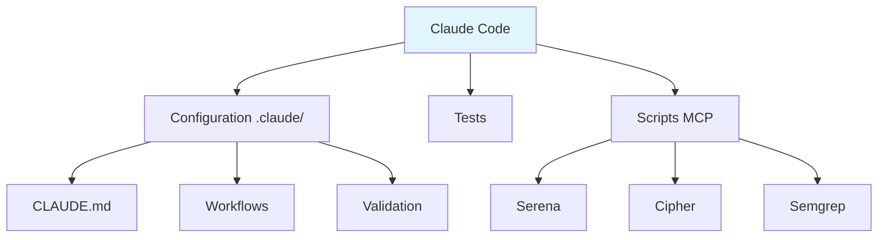

# 🛠️ Framework de Configuration Claude Code

> Projet personnel qui consolide les bonnes pratiques Claude Code dans une dynamique d'amélioration continue avec Anti-hallucination intégrée

**Statut** : Expérimental • **Focus** : Qualité > Quantité • **Communauté** : Contributions bienvenues

[](https://github.com/ccolleatte/claude-code-starter/actions)
[](https://github.com/ccolleatte/claude-code-starter)
[](https://github.com/ccolleatte/claude-code-starter)
[](https://github.com/ccolleatte/claude-code-starter)
[](LICENSE)

---

## 🚀 Démarrage rapide

```bash
# Cloner et configurer
git clone https://github.com/ccolleatte/claude-code-starter.git
cd claude-code-starter

# Configuration environnement
cp .env.example .env
# Éditer .env avec vos clés API

# Validation installation
npm run validate

# Lancer les tests
npm test

# Serveur local (optionnel)
python -m http.server 8080
```

## 💡 Pourquoi ce projet ?

J'ai développé ce kit pour **mes propres besoins** de développement avec Claude Code. Plutôt que de garder ces pratiques pour moi, je les partage en espérant qu'elles puissent être utiles à d'autres développeurs.

**Ce n'est pas** un framework enterprise-ready. **C'est** une collection de bonnes pratiques testées et documentées.

---

## 📈 Statut actuel

**🌱 Projet expérimental en développement**
- **Objectif** : Documenter et partager les meilleures pratiques Claude Code
- **Approche** : Itération et amélioration basées sur l'usage réel
- **Philosophie** : Transparence et authenticité avant tout
- **Communauté** : En construction, approche communautaire privilégiée

### Ce qui fonctionne déjà
- ✅ Instructions Claude v2 avec workflow adaptatif
- ✅ Intégration TodoWrite native
- ✅ Configuration MCP autonome
- ✅ Documentation proof-driven
- ✅ Suite de tests de base

### Ce qui reste à faire
- 🔄 Templates réutilisables (en cours)
- 🔄 Métriques de performance réelles
- 🔄 Retours d'expérience communauté

---

## 📁 Structure du framework

```
├── .claude/                    # 🔧 Configuration centrale
│   ├── CLAUDE.md              # Règles critiques (v2)
│   ├── CLAUDE-WORKFLOWS.md    # Workflows détaillés
│   ├── CLAUDE-VALIDATION.md   # Validation proof-driven
│   ├── CLAUDE-ERRORS.md       # Bibliothèque d'erreurs
│   ├── scripts/               # Scripts serveurs MCP
│   └── metrics/               # Monitoring (basique)
├── docs/                      # 📖 Documentation
├── tests/                     # 🧪 Tests (18 tests)
└── scripts/                   # 🛠️ Utilitaires
```



## 🎯 Principales innovations

### 1. **Architecture Modulaire avec Workflow adaptatif (v2)**
- Classification automatique des tâches (Simple/Complexe/Critique)
- Communication graduée selon la complexité
- Validation conditionnelle (pas de sur-processification)

### 2. **TodoWrite natif avec Surveillance Temps Réel**
- Abandon des fichiers externes (tasks/todo.md)
- Tracking temps réel intégré à Claude Code
- Une seule tâche in_progress à la fois

### 3. **Validation proof-driven**
- Jamais d'affirmation sans preuve d'exécution
- Stop conditions automatiques
- Anti-hallucination strict

## 🔴 Règles critiques

```bash
1. JAMAIS créer sans analyser : mcp__serena__list_dir OBLIGATOIRE
2. TOUJOURS prouver par exécution : Pas d'affirmation sans output
3. TodoWrite OBLIGATOIRE : Outil intégré exclusivement
4. Tests avant code : RED → GREEN → REFACTOR sans exception
```

*[Règles complètes dans .claude/CLAUDE.md]*

## ⚡ Commandes essentielles

```bash
# Développement
npm run validate          # Validation complète
npm test                  # Suite de tests
npm run check:env        # Vérification environnement

# Qualité
npm run lint             # Linting
npm run format           # Formatage

# Sécurité
Gitleaks scan             # Détection secrets
scripts/claude-metrics.sh # Métriques sécurité

# CI/CD
npm run ci:local         # Validation pré-commit
```

## 🧪 Stratégie de test et qualité

**Suite de tests basique** (18 tests) :
- Validation syntaxe templates
- Fonctionnalité scripts MCP
- Tests d'intégration

```bash
# Tous les tests
npm test

# Tests spécifiques
pytest tests/claude/test_templates_syntax.py
pytest tests/claude/test_mcp_scripts.py
```

**Objectifs qualité** (modestes mais réels) :
- ✅ Syntaxe templates valide
- ✅ Scripts MCP fonctionnels
- ✅ Configuration cohérente
- 🔄 Couverture tests à améliorer

## 🔧 Serveurs MCP intégrés

| Serveur | Usage | État | Info |
|---------|-------|------|------|
| **Serena** | Code | ✅ | Testé |
| **Cipher** | Mémoire | ✅ | Testé |
| **Semgrep** | Sécurité | ✅ | Testé |
| **Exa** | Docs | 🔄 | Opt. |

*Configuration : [.claude/scripts/](.claude/scripts/)*

## 📚 Documentation

**Documentation principale :**
- [CLAUDE-FR.md](.claude/CLAUDE-FR.md) - Règles critiques v2 (français)
- [CLAUDE.md](.claude/CLAUDE.md) - Règles critiques v2
- [CLAUDE-WORKFLOWS-FR.md](.claude/CLAUDE-WORKFLOWS-FR.md) - Workflows TodoWrite
- [CLAUDE-VALIDATION.md](.claude/CLAUDE-VALIDATION.md) - Validation adaptative
- [MONITORING-FR.md](docs/claude/MONITORING-FR.md) - Surveillance temps réel

## 🤝 Contribuer

**Toutes les contributions sont bienvenues !**

1. **Fork** le repository
2. **Créer** une branche : `git checkout -b feature/amelioration`
3. **Tester** : `npm test`
4. **Commit** : `git commit -m "feat: ajoute amélioration"`
5. **Push** et créer une PR

**Pas d'exigences strictes** - toute aide est appréciée, même les petites améliorations.

## 📊 Métriques de performance réelles

**Performance actuelle** (mesurées) :

| Métrique | Valeur |
|----------|--------|
| Chargement config | ~45ms |
| Suite tests | ~12s |
| Taille kit | ~2.1MB |

**Utilisation** (honnête) :

- Utilisateurs actifs : En cours d'évaluation
- Issues ouvertes : Voir [GitHub Issues](https://github.com/ccolleatte/claude-code-starter/issues)

## 🔍 Prochaines étapes

**Priorités à court terme** :
- 📋 Améliorer les templates de base
- 🧪 Étendre la couverture de tests
- 📖 Enrichir la documentation
- 🔄 Recueillir feedback utilisateurs

**Vision long terme** :
- Développer une vraie communauté si adoption
- Intégrer plus de serveurs MCP utiles
- Créer des guides par use-case

## 🚨 Limitations actuelles

**Soyons transparents** :
- Configuration peut être complexe pour débutants
- Tests encore basiques (pas de E2E)
- Documentation incomplète sur certains aspects
- Métriques limitées (pas de dashboard fancy)

**Mais c'est un début honnête !**

## 📞 Support et contact

- **🐛 Bugs** : [GitHub Issues](https://github.com/ccolleatte/claude-code-starter/issues)
- **💬 Questions** : [GitHub Discussions](https://github.com/ccolleatte/claude-code-starter/discussions)
- **📧 Contact direct** : Issues GitHub de préférence

## 📄 Licence

MIT License - voir [LICENSE](LICENSE) pour les détails.

---

**Claude Starter Kit v4.2** - *Un projet modeste qui grandit avec sa communauté*

⭐ **Star ce repo** si ces pratiques t'ont aidé dans ton développement avec Claude !