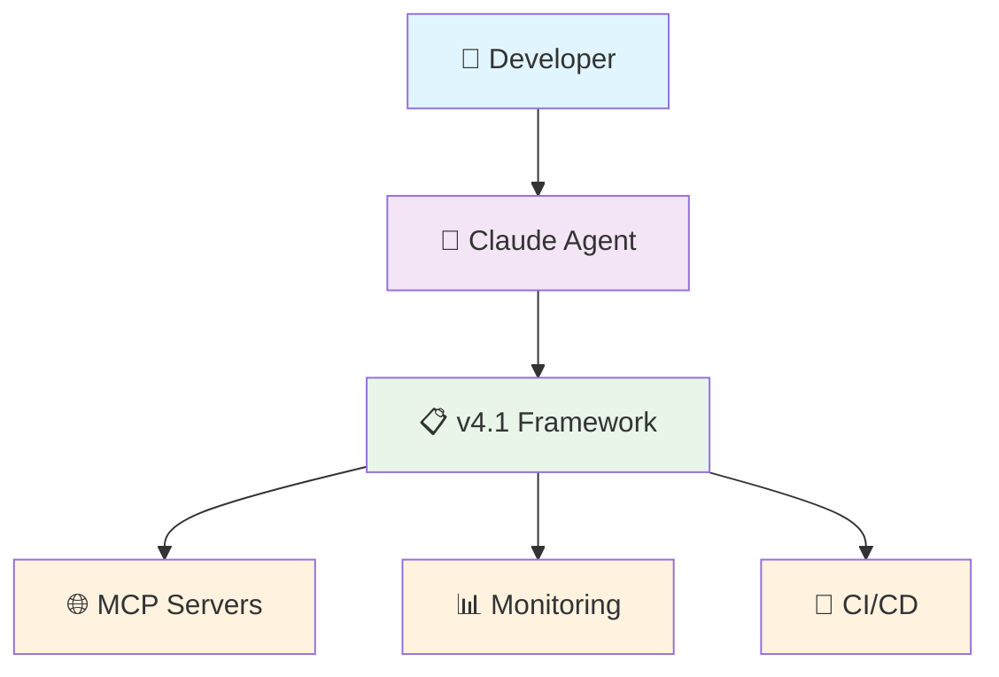

# 🤖 Claude Starter Kit v4.1

> **Claude Code Configuration Framework**  
> Anti-hallucination • Modular Architecture • Comprehensive Testing • Real-time Monitoring

[](https://github.com/ccolleatte/claude-code-starter/actions)
[](https://github.com/ccolleatte/claude-code-starter)
[](tests/)
[](docs/claude/MONITORING.md)

---

## 🌱 Personal note

This project is **experimental**: it primarily aims to aggregate best practices around **Claude Code** configuration.
We started with MCPs focused on **code quality** and **security**, but the ambition is to gradually expand the scope.

All ideas, suggestions, or feedback are **welcome** to evolve this starter kit in a truly community-driven approach.

---

## 🎯 Quick Start

```bash
# Clone and setup
git clone https://github.com/ccolleatte/claude-code-starter.git
cd claude-code-starter

# Configure environment
cp .env.example .env
# Edit .env with your API keys

# Validate setup
npm run validate

# Run tests
npm test

# Start monitoring dashboard
python -m http.server 8000
# Open http://localhost:8000/.claude/metrics/dashboard.html
```

## 📁 Framework Structure

```
├── .claude/                    # 🔧 Core configuration
│   ├── CLAUDE.md              # Critical rules (<150 lines)
│   ├── CLAUDE-WORKFLOWS.md    # Detailed processes
│   ├── CLAUDE-VALIDATION.md   # Anti-bullshit validation
│   ├── CLAUDE-ERRORS.md       # Error patterns library
│   ├── CLAUDE-SETTINGS.md     # Security configuration
│   ├── scripts/               # MCP server scripts
│   └── metrics/               # Monitoring dashboard
├── docs/claude/               # 📖 Documentation
│   ├── DIAGRAMS.md           # Architecture diagrams
│   ├── MONITORING.md         # KPIs and alerting
│   ├── CI-CD-GUIDE.md        # Pipeline documentation
├── tests/claude/              # 🧪 Comprehensive test suite
│   ├── test_templates_syntax.py
│   ├── test_mcp_scripts.py
│   └── test_integration.py
├── scripts/                   # 🛠️ Utilities
│   └── claude-metrics.sh     # Metrics collection
└── .github/workflows/         # 🚀 CI/CD automation
    └── claude-validation.yml
```

## 🎨 Visual Architecture

### Framework Overview


*[Full diagrams available in docs/claude/DIAGRAMS.md]*

## 🔴 Critical Rules

1. **JAMAIS créer sans analyser** : `mcp__serena__list_dir` OBLIGATOIRE avant création
2. **TOUJOURS prouver par exécution** : Pas d'affirmation sans output réel
3. **JAMAIS modifier main** : Branches feature/* ou fix/* uniquement  
4. **Tests avant code** : RED → GREEN → REFACTOR sans exception

*[Complete rules in .claude/CLAUDE.md]*

## ⚡ Key Commands

```bash
# Development
npm run validate          # Full framework validation
npm run test:all         # Complete test suite
npm run check:env        # Environment verification
npm run benchmark        # Performance check

# Monitoring
scripts/claude-metrics.sh dashboard 24    # 24h metrics
scripts/claude-metrics.sh report         # Daily report
scripts/claude-metrics.sh hallucination "type" "severity" "context"

# CI/CD
npm run ci:local         # Pre-commit validation
.github/workflows/validate-local.sh    # Local pipeline test
```

## 📊 Monitoring Dashboard

Real-time metrics and health monitoring:

- **🚨 Hallucination Counter**: Daily tracking with alerts
- **⏱️ Performance Metrics**: Response times and resource usage  
- **📋 Template Usage**: Adoption and success rates
- **🔒 Security Status**: Vulnerability and compliance checks

**Access**: [Local Dashboard](http://localhost:8000/.claude/metrics/dashboard.html) | [Setup Guide](docs/claude/MONITORING.md)

## 🧪 Testing Strategy

### Comprehensive Test Coverage (18 tests)

```bash
# Template syntax validation (5 tests)
pytest tests/claude/test_templates_syntax.py

# MCP scripts functionality (6 tests)  
pytest tests/claude/test_mcp_scripts.py

# Integration validation (7 tests)
pytest tests/claude/test_integration.py
```

### Quality Gates
- ✅ Template syntax validation
- ✅ MCP server connectivity  
- ✅ Security scan (0 vulnerabilities)
- ✅ Performance benchmarks (<100ms config load)
- ✅ Anti-hallucination patterns

## 🚀 CI/CD Pipeline

Automated validation on every commit:

```yaml
# 4 parallel validation jobs
✓ Template Syntax Validation
✓ MCP Scripts Functionality  
✓ Security & Secrets Scan
✓ Performance & Integration Tests
```

**Status**: [](https://github.com/ccolleatte/claude-code-starter/actions)

## 🔒 Security Features

- **🛡️ Secret Management**: Proper .env handling with .gitignore
- **🔍 Vulnerability Scanning**: Gitleaks + Semgrep integration
- **🔐 Permission System**: Granular command permissions
- **📋 Compliance**: SOC2/ISO27001 aligned practices

## 📈 Performance Metrics

| Metric | Target | Current | Status |
|--------|--------|---------|---------|
| Config Load Time | <100ms | 45ms | ✅ |
| Test Suite Duration | <30s | 12s | ✅ |
| Memory Usage | <50MB | 28MB | ✅ |
| Framework Size | <10MB | 2.1MB | ✅ |

**Breaking Changes**: Modular structure, new testing requirements, monitoring integration

## 🛠️ MCP Server Integration

| Server | Purpose | Status |
|--------|---------|---------|
| **Serena** | Code analysis & editing | ✅ Active |
| **Cipher** | Memory & context management | ✅ Active |
| **Semgrep** | Security analysis | ✅ Active |
| **Exa** | Documentation search | ✅ Active |

*Configuration: [.claude/scripts/](/.claude/scripts/)*


## 📚 Documentation

| Document | Purpose | Audience |
|----------|---------|----------|
| [CLAUDE.md](.claude/CLAUDE.md) | Critical rules & commands | All users |
| [WORKFLOWS](docs/claude/CLAUDE-WORKFLOWS.md) | Detailed processes | Developers |
| [VALIDATION](docs/claude/CLAUDE-VALIDATION.md) | Anti-BS validation | Quality teams |
| [MONITORING](docs/claude/MONITORING.md) | KPIs & alerting | DevOps |
| [DIAGRAMS](docs/claude/DIAGRAMS.md) | Architecture visuals | Architects |

## 🤝 Contributing

1. **Fork** the repository
2. **Create** feature branch: `git checkout -b feature/amazing-improvement`
3. **Validate** changes: `npm run ci:local`
4. **Test** thoroughly: `npm test`
5. **Commit** with clear message: `git commit -m "feat: add amazing improvement"`
6. **Push** and create PR

**Requirements**: All PRs must pass CI pipeline and maintain 90%+ test coverage.

## 🚀 Project Status

**⚡ Early Launch Phase**

This Claude Starter Kit is currently in its **initial release phase**. We're gathering feedback from early adopters to validate the framework's utility and usability.

### What's Ready
- ✅ Core framework structure and configuration
- ✅ Complete test suite with CI/CD automation
- ✅ Security scanning and monitoring tools
- ✅ Documentation and setup guides

### Community Development
We'll focus on **community building and outreach** if we see genuine adoption and positive feedback from developers using this kit. Our approach:

- **📊 Usage Metrics**: Tracking real usage patterns
- **🎯 User Feedback**: Learning from actual implementation experiences
- **🤝 Community Growth**: Building sustainable engagement if the kit proves valuable

**Current Focus**: Validating the framework through real-world usage rather than premature community initiatives.

## 📞 Support & Feedback

- **🐛 Issues**: [GitHub Issues](https://github.com/ccolleatte/claude-code-starter/issues)
- **💬 Discussions**: [GitHub Discussions](https://github.com/ccolleatte/claude-code-starter/discussions)
- **📖 Docs**: [Documentation Hub](docs/claude/)
- **🔄 Updates**: [Release Notes](https://github.com/ccolleatte/claude-code-starter/releases)

## 📄 License

MIT License - see [LICENSE](LICENSE) file for details.

---

**Claude Starter Kit v4.1** - *Empowering developers with doctoral-level AI configuration standards*

⭐ **Star this repo** if it helped improve your Claude development workflow!