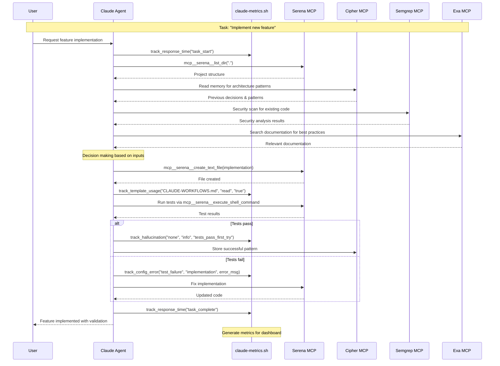
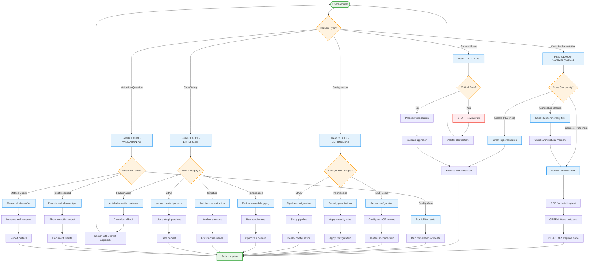
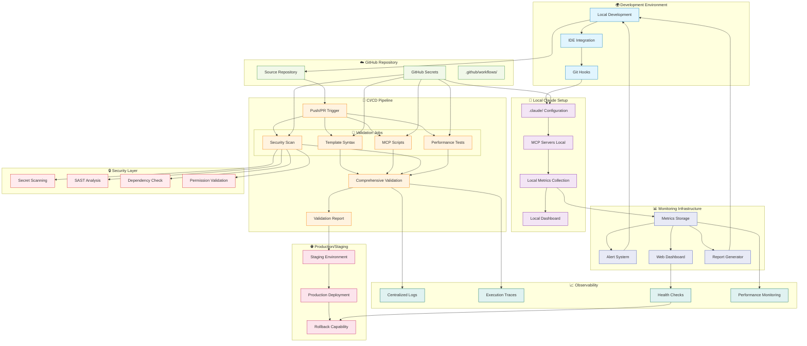
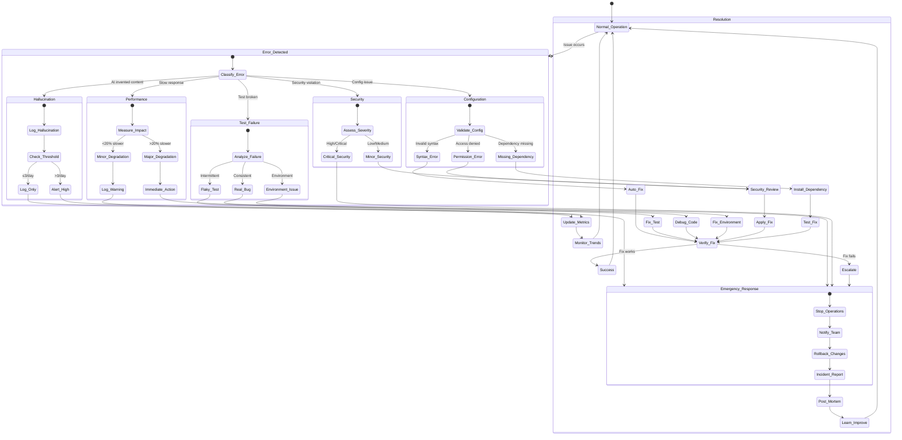
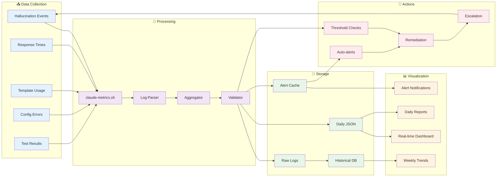

# Claude v4.1 Framework - Architecture Diagrams

## 🏗️ Architecture Overview

```mermaid
graph TB
    subgraph "👤 User Layer"
        USER[Developer]
        IDE[IDE/Editor]
        CLI[Command Line]
    end

    subgraph "🤖 Claude Interface"
        CLAUDE[Claude Code Agent]
        CONFIG[Configuration Loader]
        HOOKS[Hook System]
    end

    subgraph "📋 Framework Core v4.1"
        subgraph "📁 .claude/"
            MAIN[CLAUDE.md<br/>Critical Rules]
            WORK[CLAUDE-WORKFLOWS.md<br/>Detailed Processes]
            VALID[CLAUDE-VALIDATION.md<br/>Anti-BS Rules]
            ERR[CLAUDE-ERRORS.md<br/>Pattern Library]
            SET[CLAUDE-SETTINGS.md<br/>Security Config]
        end
        
        subgraph "🔧 Scripts"
            CIPHER_MCP[cipher-mcp.sh]
            SERENA_MCP[serena-mcp.sh]
            SEMGREP_MCP[semgrep-mcp.sh]
            EXA_MCP[exa-mcp.sh]
            METRICS[claude-metrics.sh]
        end
    end

    subgraph "🌐 MCP Servers"
        CIPHER[(Cipher<br/>Memory)]
        SERENA[(Serena<br/>Code Analysis)]
        SEMGREP[(Semgrep<br/>Security)]
        EXA[(Exa<br/>Search)]
    end

    subgraph "🧪 Testing Layer"
        TEST_SYNTAX[test_templates_syntax.py]
        TEST_MCP[test_mcp_scripts.py]
        TEST_INTEGRATION[test_integration.py]
    end

    subgraph "📊 Monitoring"
        DASHBOARD[Real-time Dashboard]
        ALERTS[Alert System]
        REPORTS[Daily Reports]
    end

    subgraph "🚀 CI/CD"
        GITHUB[GitHub Actions]
        VALIDATION[Validation Pipeline]
        DEPLOY[Deployment]
    end

    %% User interactions
    USER --> IDE
    USER --> CLI
    IDE --> CLAUDE
    CLI --> CLAUDE

    %% Claude core interactions
    CLAUDE --> CONFIG
    CONFIG --> MAIN
    CONFIG --> WORK
    CONFIG --> VALID
    CONFIG --> ERR
    CONFIG --> SET

    %% MCP connections
    CLAUDE --> CIPHER_MCP --> CIPHER
    CLAUDE --> SERENA_MCP --> SERENA
    CLAUDE --> SEMGREP_MCP --> SEMGREP
    CLAUDE --> EXA_MCP --> EXA

    %% Testing connections
    GITHUB --> TEST_SYNTAX
    GITHUB --> TEST_MCP
    GITHUB --> TEST_INTEGRATION

    %% Monitoring flows
    CLAUDE --> METRICS
    METRICS --> DASHBOARD
    METRICS --> ALERTS
    METRICS --> REPORTS

    %% CI/CD flows
    USER --> GITHUB
    GITHUB --> VALIDATION
    VALIDATION --> DEPLOY

    %% Hook system
    CLAUDE --> HOOKS
    HOOKS --> METRICS

    %% Styling
    classDef userLayer fill:#e1f5fe
    classDef claudeLayer fill:#f3e5f5
    classDef frameworkCore fill:#e8f5e8
    classDef mcpLayer fill:#fff3e0
    classDef testLayer fill:#fce4ec
    classDef monitorLayer fill:#f1f8e9
    classDef cicdLayer fill:#e0f2f1

    class USER,IDE,CLI userLayer
    class CLAUDE,CONFIG,HOOKS claudeLayer
    class MAIN,WORK,VALID,ERR,SET,CIPHER_MCP,SERENA_MCP,SEMGREP_MCP,EXA_MCP,METRICS frameworkCore
    class CIPHER,SERENA,SEMGREP,EXA mcpLayer
    class TEST_SYNTAX,TEST_MCP,TEST_INTEGRATION testLayer
    class DASHBOARD,ALERTS,REPORTS monitorLayer
    class GITHUB,VALIDATION,DEPLOY cicdLayer
```

## 🔄 MCP Data Flow

## 🌳 Template Decision Tree

## 🚀 Deployment Architecture

## 🔍 Error Flow Diagram

## 📊 Metrics Flow

---
**Note**: Ces diagrammes sont rendus par Mermaid et peuvent être intégrés dans la documentation GitHub, GitLab, ou tout système supportant la syntaxe Mermaid.

**Utilisation**: 
- Copier le code Mermaid dans un fichier `.md`
- Afficher dans un visualiseur Mermaid
- Intégrer dans la documentation projet